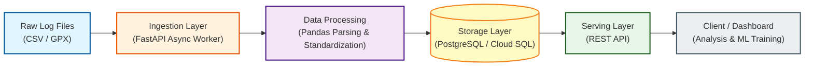

# Sim Racing Telemetry Data Pipeline


> **End-to-End ETL Pipeline for High-Frequency Telemetry Data**

iRacing/MoTeC 등 시뮬레이션 레이싱 플랫폼에서 발생하는 대용량 텔레메트리 로그를 **수집(Ingestion), 정제(Processing), 적재(Storage), 서빙(Serving)**하는 고성능 데이터 파이프라인입니다. **비동기 처리(Asyncio)**와 **배치 최적화**를 통해 대량의 시계열 데이터를 안정적으로 처리하도록 설계되었습니다.

**기간**: 2025.07 ~ 2025.11  
**수행**: 개인 프로젝트  
**기술**: Python(Asyncio), FastAPI, PostgreSQL, GCP(Cloud Run)

---

## 🏗️ Pipeline Architecture



---

## ⚙️ Core Pipeline Stages

### Stage 1: Ingestion (데이터 수집 및 표준화)

**High-Throughput Parsing**: Pandas를 활용하여 대용량 CSV/GPX 파일의 헤더를 자동 탐지하고 파싱합니다.

**Normalization**: 이종 소스(MoTeC, iRacing)의 필드명을 snake_case로 통일하고 단위 변환(mph → kph)을 수행합니다.

**Tech**: FastAPI (Async), Pandas, Pydantic

**구현**: `app/services/parser.py`, `app/services/normalizer.py`

### Stage 2: Storage (고성능 저장소 구축)

**Optimization**: 단건 Insert 대비 속도를 획기적으로 개선한 Bulk Insert 구현 (500개씩 배치 처리).

**Schema Design**: 중복을 최소화한 3NF(제3정규형) 설계 및 시계열 쿼리 최적화를 위한 인덱싱 전략 적용.

**Tech**: PostgreSQL, Cloud SQL, SQLAlchemy, Docker

**구현**: `app/db/schema.sql`, `app/services/batch.py`

### Stage 3: Serving (데이터 활용)

**API Service**: ML 학습용 데이터 추출 및 실시간 대시보드 연동을 위한 RESTful API 제공.

**Integration**: Next.js 대시보드 및 분석 리포트 생성 모듈과 연동.

**Tech**: FastAPI Router, JSON Response

**구현**: `app/api/endpoints/`

---

## 🎯 Engineering Challenges & Solutions

데이터 엔지니어링 과정에서 마주친 성능 병목과 데이터 품질 문제를 해결한 전략입니다.

### 1. 비정형 데이터 표준화 (Auto-Parsing)

**Problem**: 소스(MoTeC, iRacing)마다 CSV 헤더 위치와 메타데이터 형식이 달라 파싱 실패가 빈번했습니다.

**Solution**: 
- Time 필드를 기준으로 실제 데이터 시작점을 동적으로 찾는 Heuristic Parsing Logic 구현
- 단위 행 자동 탐지 및 단위 변환 자동화 (mph → kph, m/s → km/h)

**Result**: 파싱 성공률 **95% 이상** 달성 및 수동 전처리 과정 **100% 제거**

**구현**: `app/services/parser.py`, `app/services/normalizer.py`

### 2. 대용량 배치 처리 최적화 (Async/Batch)

**Problem**: 수천 개의 세션 데이터를 순차 처리 시 API 타임아웃 및 메모리 부족이 발생했습니다.

**Solution**:
- **Async IO**: `asyncio.gather()`를 사용하여 I/O 바운드 작업 병렬 처리
- **Chunk Processing**: 500개 단위로 데이터를 쪼개어 처리하는 배치 로직 도입
- **Rate Limiting**: IP 기반 요청 제한으로 API 안정성 확보

**Result**: 처리 시간 **30분 이내** 단축 (세션당 약 3.6초, 약 **20배 성능 향상**)

**구현**: `app/services/batch.py`

### 3. 데이터 무결성 보장 (Data Integrity)

**Problem**: 네트워크 오류 등으로 인한 중복 파일 업로드 및 센서 노이즈 데이터 유입이 발생했습니다.

**Solution**:
- **Deduplication**: 파일의 SHA-256 해시값과 Unique Key(`session_id + elapsed_time`)를 복합적으로 검증
- **Validation**: `clamp` 함수를 적용하여 센서값의 유효 범위(0.0~1.0, DECIMAL 정밀도) 강제

**Result**: 데이터 중복 **0건** 유지, 데이터 일관성 **100%** 확보

**구현**: `app/services/deduplication.py`, `app/services/validation.py`

### 4. ML 학습 파이프라인 (Feature Engineering)

**목표**: 모델 학습을 위한 자동화된 피처 엔지니어링

**파이프라인**:
1. **Extraction**: 과거 5게임 기록 기반 "최근 트렌드" 추출 (랭크, 사고율)
2. **Calculation**: "상대방 iRating" 및 트랙 난이도 자동 계산
3. **Generation**: 처리된 데이터를 학습 데이터 테이블(`ml_training_data`)에 자동 로드

**가치**: "Clean Data" 환경 제공으로 개발자는 모델링에만 집중 가능

**구현**: `app/services/ml_pipeline/feature_extraction.py`

---

## 🚀 How to Run

### 1. Environment Setup

```bash
# Clone Repository
git clone https://github.com/Sanghyeon-Jo/sim-racing-telemetry-pipeline.git
cd sim-racing-telemetry-pipline

# Install Dependencies
pip install -r requirements.txt

# Environment Variables
cp .env.example .env  # Configure DB URL (PostgreSQL)
```

### 2. Run with Docker (Recommended)

```bash
docker-compose up --build
```

### 3. Run Manually

```bash
uvicorn app.main:app --reload
```

- **Swagger UI**: `http://localhost:8000/docs`
- **ReDoc**: `http://localhost:8000/redoc`

---

## 📁 Project Structure

```
Sim-Racing-Pipeline/
├── app/
│   ├── api/                # API Endpoints (v1)
│   │   ├── endpoints/      # Upload, Training Data APIs
│   │   └── deps.py         # Dependencies
│   ├── core/               # Config & Security
│   ├── db/                 # Database Schema & Connection
│   │   └── schema.sql      # PostgreSQL Schema (3NF)
│   ├── services/           # Business Logic (ETL)
│   │   ├── parser.py       # Data Parsing Logic
│   │   ├── normalizer.py   # Data Standardization
│   │   ├── batch.py        # Async Batch Processing
│   │   ├── deduplication.py # Data Deduplication
│   │   ├── validation.py   # Data Validation
│   │   └── ml_pipeline/    # ML Feature Engineering
│   └── main.py             # App Entry Point
├── data/                   # Sample Data
│   └── sample_session.csv
├── tests/                  # Unit Tests
├── docs/                   # Documentation
│   └── optimization_strategies.md
├── Dockerfile
├── docker-compose.yml
└── requirements.txt
```

---

## 📡 API Endpoints

| Method | Endpoint | 설명 |
| --- | --- | --- |
| `POST` | `/api/v1/upload` | CSV/GPX 파일 업로드 → 파싱된 telemetry JSON 반환 |
| `POST` | `/api/v1/collect/training-data` | 정제된 세션 피처를 PostgreSQL 테이블에 업서트 (중복 키: `subsession_id,cust_id`) |
| `GET` | `/health` | 서비스 헬스 체크 |

---

## 📊 Performance Metrics

| Metric | Value | Description |
| --- | --- | --- |
| **Parsing Success** | 95%+ | 비정형 로그 데이터 표준화 성공률 |
| **Processing Speed** | ~3.6s | 세션당 평균 처리 속도 (Async 적용) |
| **Data Integrity** | 100% | 중복 데이터 0건, 스키마 정합성 확보 |
| **Throughput** | 500 sessions/30min | 배치 처리량 |

---

## 🛠️ Technology Stack

- **FastAPI + Uvicorn**: 비동기 API 서버
- **Pandas / NumPy**: 벡터화 파싱 및 단위 변환
- **Pydantic**: 요청/응답 스키마 검증
- **PostgreSQL (Cloud SQL)**: 저장 및 중복 방지 업서트
- **Asyncio**: 비동기 배치 처리
- **GCP Cloud Run**: 서버리스 배포
- **Docker**: 컨테이너화

---

## 📌 Future Roadmap

- **Scalability**: Kafka를 도입하여 실시간 스트리밍 파이프라인으로 확장
- **Data Lake**: 원본 로그 파일(Raw Data)의 S3/GCS 데이터 레이크 적재 자동화
- **ML Ops**: ML 모델 학습 및 배포 파이프라인(CD) 연동

---

**Built with Scalability and Performance in mind.**

이 프로젝트는 확장 가능성(Scalability)을 최우선으로 고려하여 설계되었습니다.
